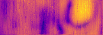
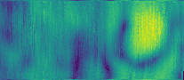

Playing around with data generated from [Project-COGSWORTH].

The `viz` tool takes the printf-like pattern of the filename, width and
height, then reads the data and outputs a pnm-image on stdout.

To compile, just type
```
make
```

Then here is how to invoke:
```
Usage: ./viz [options] <filename-pattern> <width> <height>
         -c <color>  : Color map. One of [0..3]
         -s <shift>  : Data shift going up/down; fix 'comb-effect'. Default 10.
         -o <outfile>: Output filename for PNM image. Default stdout
Example:
./viz -c3 -o foo.pnm SAMPLE_3162099_%d_%d.dmp 207 80
```

Here a concrete run with data provided by Paul:
```
make
./viz /tmp/3162099/SAMPLE_3162099_%d_%d.dmp 207 80 | pnmtopng > /tmp/foulab.png
timg /tmp/foulab.png
```

Useful is the [timg] tool to visualize on the shell.

Speed is mostly limited by DiskIO, but if there is enough buffer cache, then
runtime is somewhat quick; here was about 2.4 seconds on my laptop.

There are different [color-maps] available to choose from that try to
associate the strength of the signal with an intuitive color mapping; choose
with the `-c` option.

Here with default color map `-c0`:


Here with colormap `-c3`:



[Project-COGSWORTH]: https://github.com/FOULAB/Project-COGSWORTH/
[timg]: https://github.com/hzeller/timg
[color-maps]: https://bids.github.io/colormap/