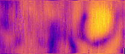

Playing around with data generated from [Project-COGSWORTH].

The `viz` tool takes the printf-like pattern of the filename, width and
height, then reads the data and outputs a pnm-image on stdout.

```
make
./viz /tmp/3162099/SAMPLE_3162099_%d_%d.dmp 200 70 | pnmtopng > /tmp/foulab.png
timg /tmp/foulab.png
```

Useful is the [timg] tool to visuzalize on the shell.



[Project-COGSWORTH]: https://github.com/FOULAB/Project-COGSWORTH/
[timg]: https://github.com/hzeller/timg